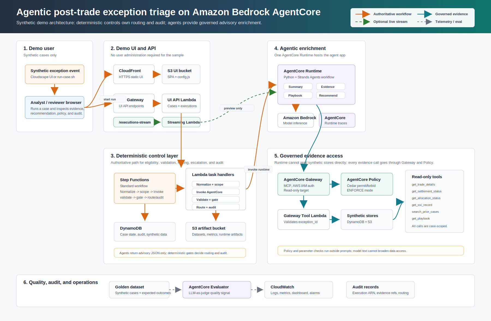

# Architecture

## Overview

The sample deploys an agent-assisted post-trade exception triage control layer on AWS. It uses synthetic data to simulate enterprise post-trade systems and returns enriched case packages to a simulated analyst workflow.

High-level flow:

```text
Synthetic exception event
  -> AWS Step Functions Standard Workflow
  -> Amazon Bedrock AgentCore Runtime
  -> Amazon Bedrock AgentCore Gateway
  -> Read-only synthetic evidence tools
  -> Deterministic output validation
  -> Enriched analyst case
  -> Cloudscape UI and audit records
```

## Architecture Diagram



The authoritative execution path is the Step Functions workflow. The optional streaming path exists only to give the demo UI live stage updates; Step Functions still records the final, validated recommendation and audit state.

## Boundary Model

The architecture preserves the conceptual boundary from the blog post:

- Existing post-trade systems remain systems of record.
- The sample simulates those systems with synthetic datasets.
- The AWS layer governs the agent-assisted path only.
- Agents produce advisory output.
- Deterministic workflow states decide routing, escalation, validation, and audit recording.

## Main AWS Components

| Component | Responsibility |
| --- | --- |
| Amazon EventBridge | Optional event entry point for synthetic exception events. |
| AWS Step Functions Standard Workflow | Agent-assisted triage control layer. |
| AWS Lambda | Deterministic task implementations and AgentCore invocation wrapper. |
| Amazon Bedrock AgentCore Runtime | Hosts the agent application. |
| Amazon Bedrock | Provides foundation model access. Runtime model family: Claude Opus 4.6; default US geo inference ID: `us.anthropic.claude-opus-4-6-v1`. AgentCore Evaluator uses a separate judge model configured by `BEDROCK_EVALUATOR_MODEL_ID`. |
| Amazon Bedrock AgentCore Gateway | Exposes approved read-only tools. |
| Amazon Bedrock AgentCore Policy | Authorizes tool, operation, and parameter access. |
| Amazon Bedrock AgentCore Evaluations | LLM-as-judge evaluator for advisory triage quality. Enabled by default and requires evaluator-specific model authorization in the target account. |
| Amazon DynamoDB | Stores synthetic operational data, case state, and audit records. |
| Amazon S3 | Stores evaluation datasets, artifacts, and static UI assets. |
| Amazon CloudWatch | Logs, metrics, dashboard, alarms, and operational visibility. |
| Amazon API Gateway | UI API for case execution, case state, and evaluation summaries. |
| Amazon CloudFront | Serves the Cloudscape UI. |

## Step Functions Workflow

Workflow name: generated by CloudFormation. Use the `StateMachineArn` stack output rather than assuming a fixed physical name.

Workflow type: Standard Workflow.

States:

1. `Normalize exception`
2. `Scope and severity`
3. `Eligible?`
4. `Invoke AgentCore`
5. `Validate output`
6. `Policy / confidence met?`
7. `Route enriched case`
8. `Manual triage`
9. `Escalate`
10. `Record audit state`

Task states use Lambda implementations. `Invoke AgentCore` uses a Lambda wrapper so the implementation can handle the exact AgentCore Runtime invocation and authentication pattern without embedding that concern into the state machine definition.

## AgentCore Runtime And Agent Framework

The sample uses one AgentCore Runtime that hosts a Python agent application implemented with Strands Agents. The application implements four Strands-based internal stages:

1. Summary stage.
2. Evidence retrieval stage.
3. Playbook mapping stage.
4. Recommendation stage.

This keeps the sample easy to deploy while still reflecting the four-agent pattern in the blog post.

Agents use Amazon Bedrock for foundation model inference. The default Runtime model family is Claude Opus 4.6 through the US geo inference ID `us.anthropic.claude-opus-4-6-v1`. AgentCore Runtime hosts the agent application; it is not the model provider. Model calls and tool calls are separate paths: model inference goes to Amazon Bedrock, and evidence retrieval goes through AgentCore Gateway. AgentCore Evaluator uses a separate LLM-as-judge model configured by `BEDROCK_EVALUATOR_MODEL_ID`.

## Gateway And Tool Access

Agents do not access synthetic data tables directly. The evidence retrieval stage calls AgentCore Gateway tools. Gateway exposes only read-only operations:

- `get_trade_details`
- `get_settlement_status`
- `get_allocation_status`
- `get_ssi_record`
- `search_prior_cases`
- `get_playbook`

Tool handlers read from synthetic DynamoDB records and return compact evidence objects with source IDs and timestamps.

Each tool call includes the active `exception_id`. The Gateway tool Lambda validates synthetic ID formats, rejects unexpected arguments, and refuses counterparty, account, root-cause, or playbook requests that do not match the active exception case.

## Demo UI Access

The Cloudscape UI is a static application behind CloudFront. The browser-facing demo API is always protected by Amazon Cognito Hosted UI and an API Gateway Cognito authorizer. Public self-registration is disabled; create or invite demo users through Cognito before sharing the protected UI. API Gateway stage throttling, a regional AWS WAF web ACL with AWS managed rules, a per-IP rate rule, WAF logging with `Authorization` header redaction, CloudFront-only CORS, a CloudFront Content-Security-Policy, Lambda reserved concurrency, and a CloudWatch execution-volume alarm are also enabled to bound casual demo abuse and cost. Production adaptations must add enterprise identity, tenant/user authorization, network controls, organization-specific WAF rules, and stronger abuse protections before exposing operational APIs.

## Analyst Workflow

The analyst workflow is simulated, not implemented as a real case-management system. The Cloudscape UI displays:

- Case timeline.
- Evidence graph.
- Recommendation card.
- Policy decisions.
- Confidence score.
- Evaluation summary.
- Links to Step Functions and CloudWatch.

## Observability

The sample must emit enough telemetry to reconstruct a case run:

- Step Functions execution ARN.
- Exception ID.
- Eligibility decision.
- Agent runtime invocation ID or session ID.
- Tool calls and tool outcomes.
- Policy decision summary.
- Recommendation JSON.
- Validation result.
- Routing or escalation outcome.
- Latency and error status.

Audit records also carry the configured Runtime model ID, AgentCore Runtime trace metadata when returned by the service, evidence source IDs, recommendation evidence references, playbook ID, and recommended queue.
